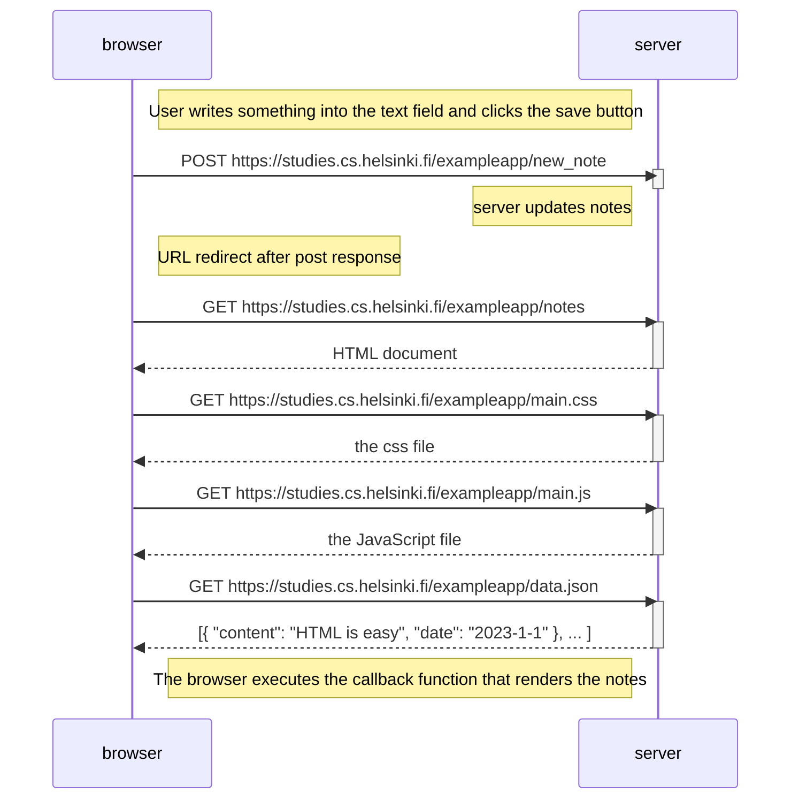
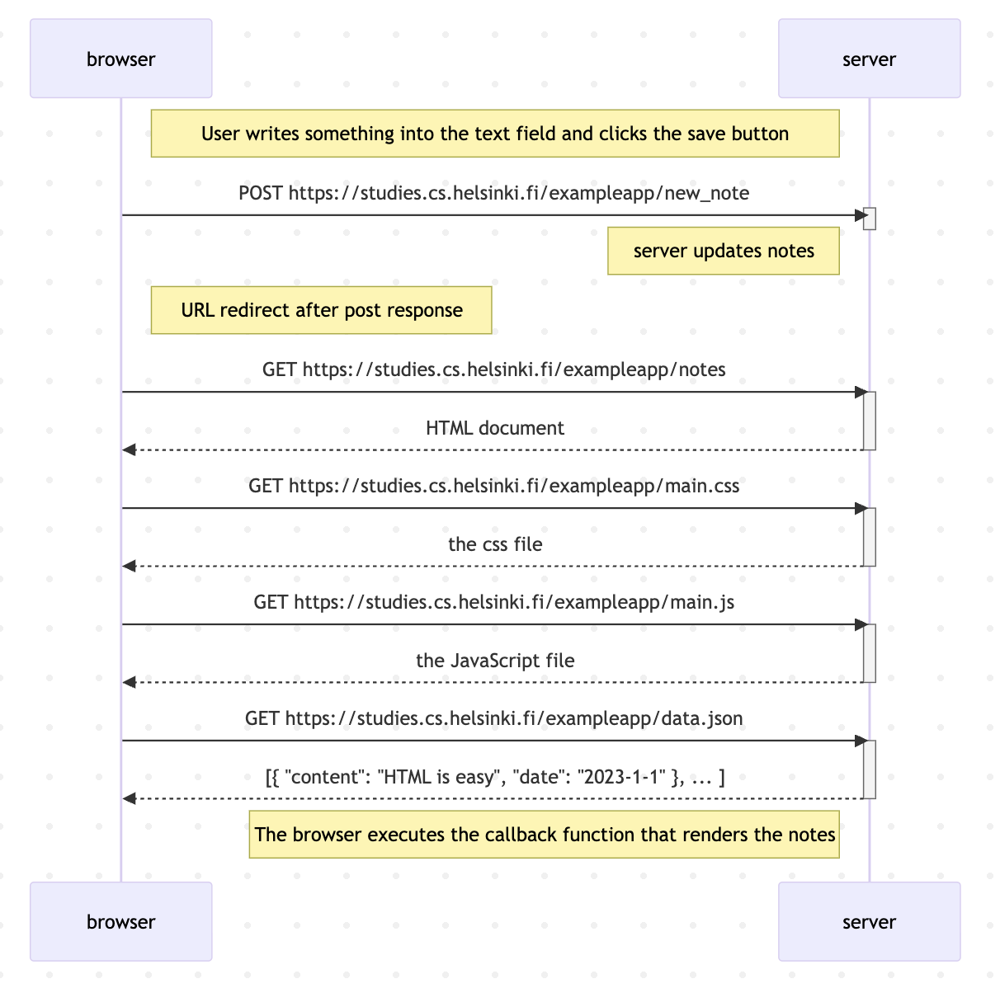

```mermaid
sequenceDiagram
    participant browser
    participant server

    Note right of browser: User writes something into the text field and clicks the save button

    browser->>server: POST https://studies.cs.helsinki.fi/exampleapp/new_note
    activate server
    deactivate server

    Note left of server: server updates notes

    Note right of browser: URL redirect after post response

    browser->>server: GET https://studies.cs.helsinki.fi/exampleapp/notes
    activate server
    server-->>browser: HTML document
    deactivate server

    browser->>server: GET https://studies.cs.helsinki.fi/exampleapp/main.css
    activate server
    server-->>browser: the css file
    deactivate server

    browser->>server: GET https://studies.cs.helsinki.fi/exampleapp/main.js
    activate server
    server-->>browser: the JavaScript file
    deactivate server

    browser->>server: GET https://studies.cs.helsinki.fi/exampleapp/data.json
    activate server
    server-->>browser: [{ "content": "HTML is easy", "date": "2023-1-1" }, ... ]
    deactivate server

    Note left of server: The browser executes the callback function that renders the notes
```

